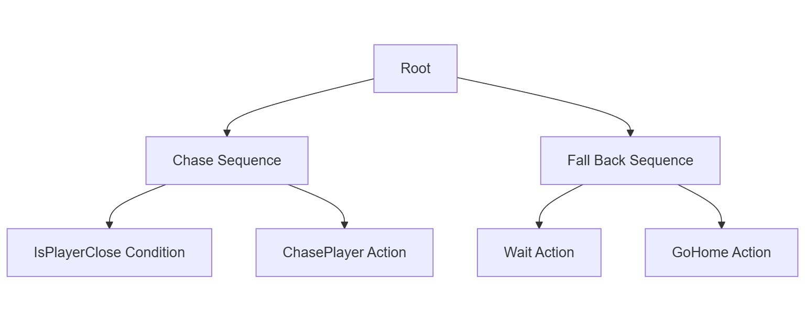

# Descripción Breve de IA
Sigue al jugador a menos que se aleje mucho. Si se aleja de rango, espera un momento y regresa a su hogar.

# Procesamiento de IA (Que percibe y como actúa)
  La única percepción que tiene es la distancia entre la IA y el player. Para saber si se cumple la condición. También percibe el tiempo que espera después de que el jugador se aleja y percibe a donde tiene que ir una ves que el jugador se aleja.
# Diagrama Behavior Tree

# Diagrama FSM

## Dificultades o problemas de desarrollo
Para mi es más difícil visualizar el behavior tree que la state machine. Pero lo que si me gusta del behavior tree es que siento que es más contenido

## Pequeño analisis de en este caso que arquitectura funciona mejor y por que.
